# User API web application

We made a web application using JS, HTML and CSS, storing data in a database (Redis) and covered it with tests of different levels. Our application is equiped with CRUD user functionality and unit tests. We added a bonus possibility to delete an user aswell with its units tests (visible in the images/LauchingApp-proof folder). 

The deployment was made to Microsoft Azure, the CI/CD pipeline using github workflow to automate the integration and the deployment.

Furthermore, we created a Docker image of the application availabe on Docker Hub and Docker Compose to start our application. The Docker Orchestration was made with Kubernetes (including deployments, services, pv and pvc).

The virtual environment was made with Ansible (configuring and provisioning 1 VM on any linux distribution). 

Finally deployment using Istio (route requets and traffic shifting between 2 versions of the application) and monitoring with Grafana and Prometheus of the k8s clusters.

# Functionality

Here is the recap of the different functionnalities that were implemented: 

1. Create a web application
2. Apply CI/CD pipeline
3. Run application using the IaC approach
4. Build Docker image of application
5. Container orchestration using Docker Compose
6. Docker orchestration using Kubernetes
7. Service mesh using Istio
8. Implementing Monitoring to containerized application

# Installation

This application is written on NodeJS and it uses Redis database. Here are all elements installed throughout the project: 

1. [Install NodeJS](https://nodejs.org/en/download/)

2. [Install Redis](https://redis.io/download)

3. [Install VirtualBox](https://www.virtualbox.org/wiki/Downloads)

4. [Install Vagrant on your computer](https://www.vagrantup.com/downloads.html)
(Optional) **On Windows**, ensure that Hyper-V is disabled:
- Open a new PowerShell.
- Run the following command: 

`Disable-WindowsOptionalFeature -Online -FeatureName Microsoft-Hyper-V-All`
5. Install [Docker Desktop](https://www.docker.com/get-started) following the instructions depending on your OS.

Make sure your docker installation is working properly by running the following command in a terminal:
```
docker run hello-world
```
6. [Install Minikube](https://kubernetes.io/docs/tasks/tools/install-minikube/) following the instructions depending on your OS.

Start Minikube with:
```
minikube start
```
Verify that everything is OK with:
```
minikube status
```
7. [Download Istio](https://istio.io/docs/setup/getting-started/)
8. [Prometheus] (https://istio.io/latest/docs/ops/integrations/prometheus/)
[Grafana] (https://istio.io/latest/docs/ops/integrations/grafana/)
9. Install application

Go to the root directory of the application (where `package.json` file located) and run: `npm install`

# Usage

## 1. Start the app from repository

From the root directory of the project run: `npm start`

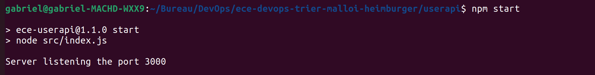

It will start a web server available in your browser at http://localhost:3000.

Please note that redis needs to be running in order to work! 
After installation, start Redis server:

- Windows: double click on `redis-server.exe` file (keep it open in another tab)
- MacOS and Linux: `redis-server`

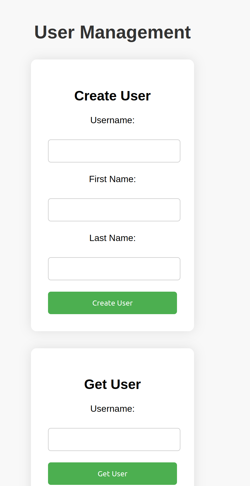
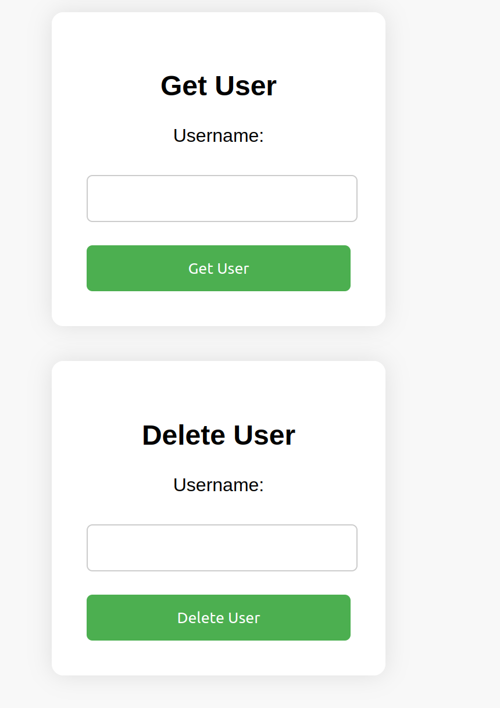

## 2. Test the app

From the root directory of the project run: `npm test`. 

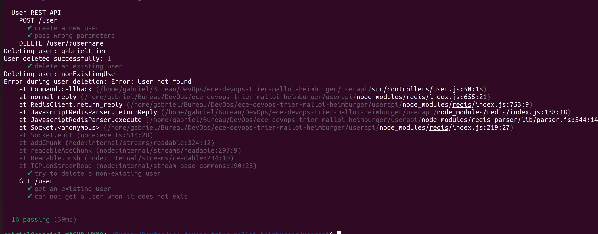
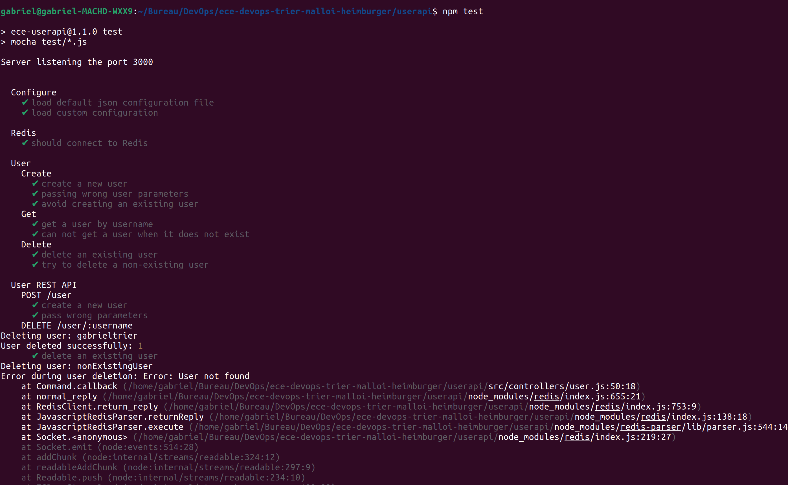

## 3. Getting docker image from docker hub

Command to pull image from Docker Hub: `docker pull gabrieltrier/userapi`.

It is still necessary to have redis running in another tab!

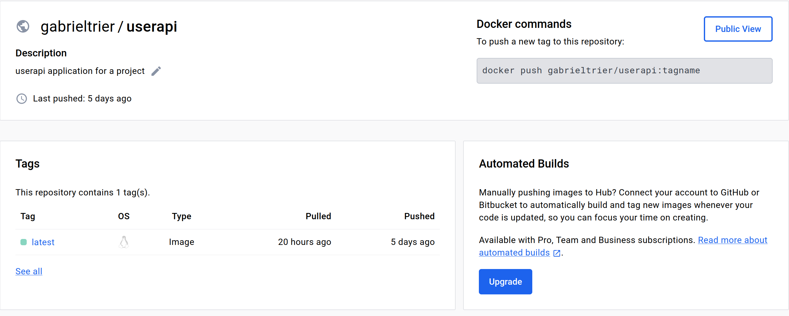

## 4. Starting application with docker-compose

Command to launch the app with all dependencies : `docker-compose up`.

Go to http://localhost:5000/ to access it. 

## 5. Docker orchestration using Kubernetes

Start minikube: `minikube start`.
Then you can inside the `\k8s` folder apply the files in the following order: 
```
kubectl apply -f deployment.yaml
kubectl apply -f service.yaml
kubectl apply -f persistentvolume.yaml
kubectl apply -f persistentvolumeclaim.yaml
```
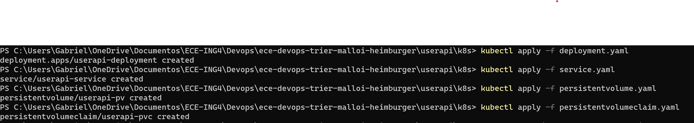

## 6. Istio 

Make sure that minikube is started : `minikube start` and that Istio is installed with istoctl client added to your path: `$ export PATH=$PWD/bin:$PATH`

After you can initialize with: `istioctl install --set profile=demo -y`

Add a namespace label automatically inject Envoy sidecar proxies:`kubectl label namespace default istio-injection=enabled`

Afterwards you can apply the `userapi.yaml`file that permits to define the deployment, service, gateway, and routing configurations for the userapi application within a Kubernetes cluster, including Istio components for handling traffic routing and TLS termination.

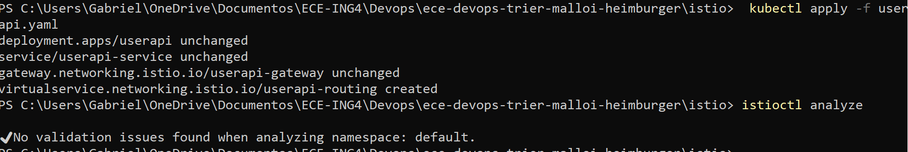

## 7. Monitoring with Prometheus and Grafana

In order to test make sure that Grafana and Prometheus are installed on your k8s clusters. 

Navigate to the k8 folder to apply all files (just like in section 5) aswell as the `servicemonitor.yaml`: 
`kubectl apply -f servicemonitor.yaml`

To access prometheus on the web: `kubectl port-forward service/prometheus-server 9090:80` . 

Then, you can access the Prometheus dashboard at http://localhost:9090.

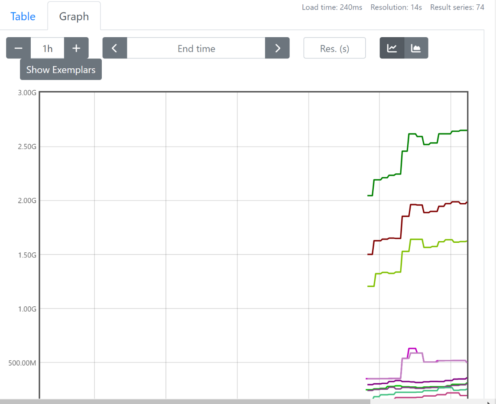

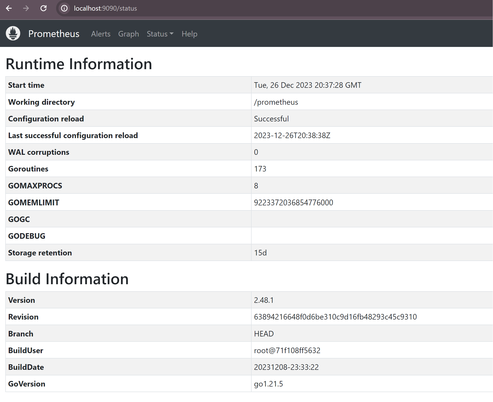

To access Grafana on the web: `kubectl port-forward service/grafana 3000:80`

Then, you can access the Grafana dashboard at http://localhost:3000.

We are able to monitor CPU and memory usage through a dashboard visible in the `\images` folder. 

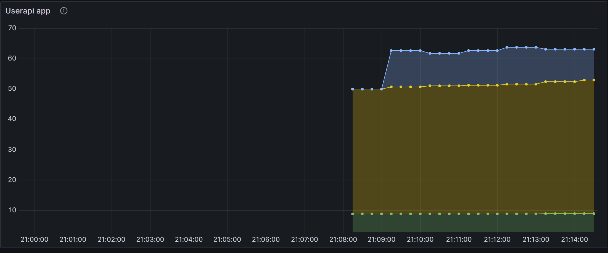
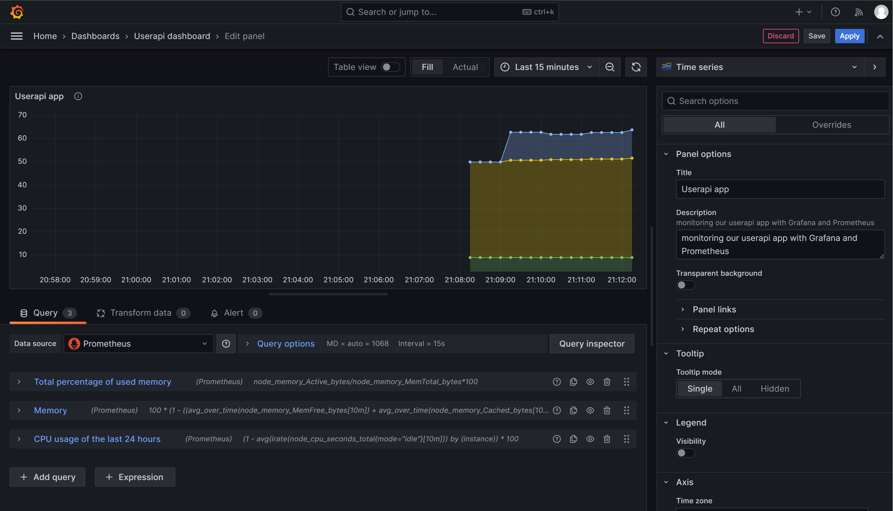
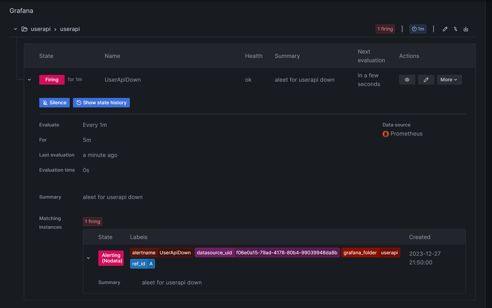

## Links
- Docker hub link: https://hub.docker.com/r/gabrieltrier/userapi
- Microsoft Azure acces point: https://devopstriermalloiheimburger.azurewebsites.net/

## Images folder
Please note that there is an image folder `\images` to illustrate functionnal parts of the project and more detailed screenshots to results obtained. 
## Authors

- Gabriel Trier
- Paul-Antoine Malloi
- Romain Heimburger
